# BlamixShell

[](https://github.com/blamixology/blamixshell/actions/workflows/release.yml)
[](https://github.com/blamixology/blamixshell/releases/latest)
[](https://github.com/blamixology/blamixshell/releases)
[](LICENSE)
[](pyproject.toml)
[](https://github.com/blamixology/blamixshell/releases/latest)

> Formerly **ShellDeck**: renamed in 1.2. Your data is carried over automatically (see [Where data lives](#where-data-lives)).

A modern SSH client for **Windows, macOS and Linux**, written in Python. Think PuTTY, plus a proper server manager, tabs and split panes, files with a built-in editor, an agentless server dashboard (services, logs, updates, Docker and Compose, firewall, security checks), and an encrypted vault. It comes in three front-ends that share one vault:

| | What | Runs on |
|---|---|---|
| **Desktop app** | Windows/macOS-style GUI with xterm.js terminals, splits, files with a built-in editor, and a server dashboard (services, logs, Docker / Compose, firewall, security …) | Windows 10/11, macOS 12+, Ubuntu 22.04+ (and other desktop Linux) |
| **TUI** | full-screen terminal UI: browse, search, connect, run on a group, and the server dashboard (`blamixshell dash`) | any Linux/macOS terminal, including over SSH on a headless box |
| **CLI** | `blamixshell ls / connect / exec / add …` for scripts and quick use | Linux, macOS (Windows: everything except interactive `connect`) |


### Screenshots

<table>
<tr>
<td width="50%"><a href="docs/screens/dashboard-overview.png">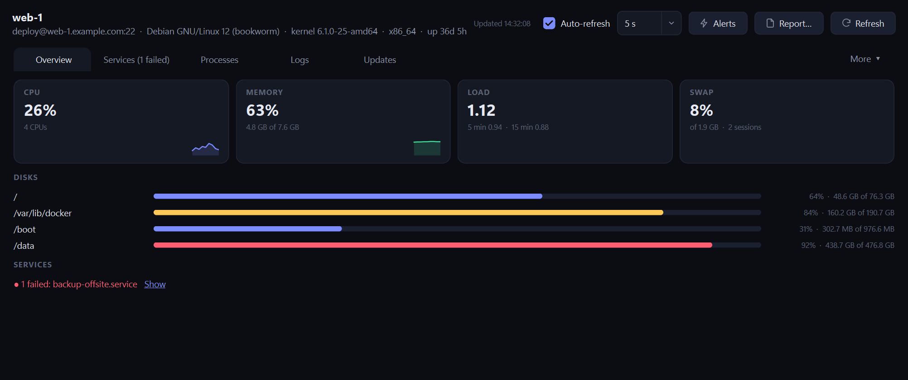</a><br><b>Server dashboard</b>: live CPU, memory, load and disks</td>
<td width="50%"><a href="docs/screens/dashboard-services.png">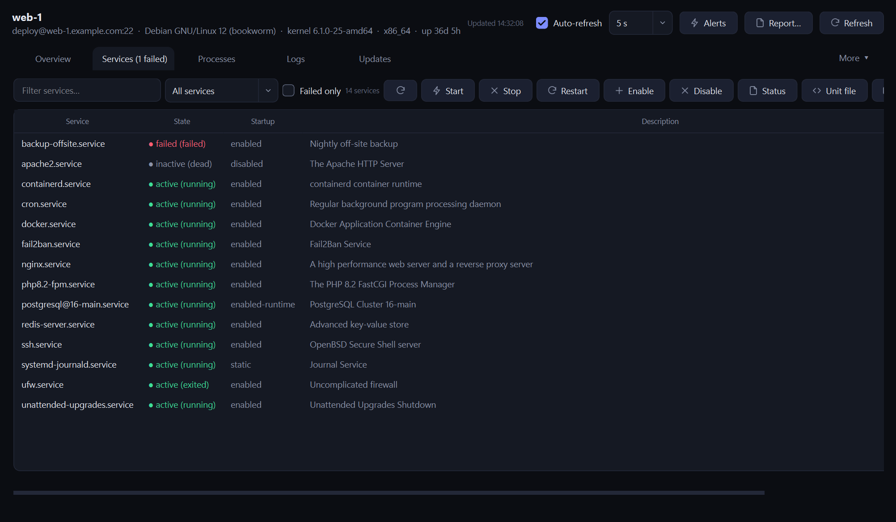</a><br><b>Services</b>: failed first, actions with a confirmation</td>
</tr>
<tr>
<td><a href="docs/screens/dashboard-docker.png">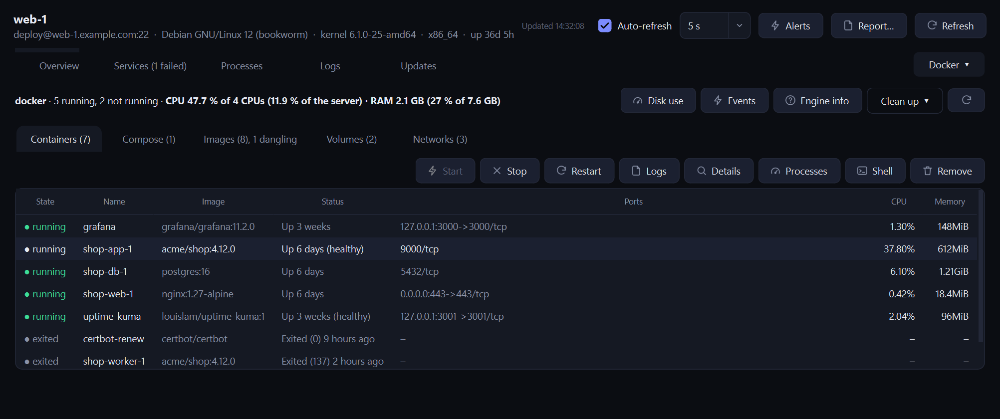</a><br><b>Docker</b>: containers with CPU / RAM totals, details, logs, shell</td>
<td><a href="docs/screens/dashboard-compose.png">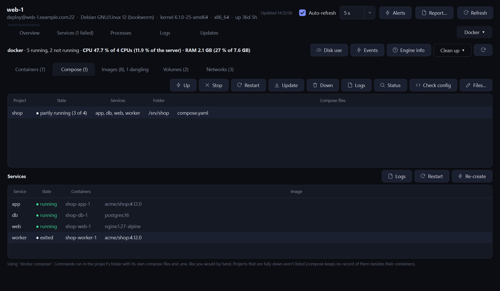</a><br><b>Compose</b>: projects and services, update, down, checked edits</td>
</tr>
<tr>
<td><a href="docs/screens/dashboard-logs.png">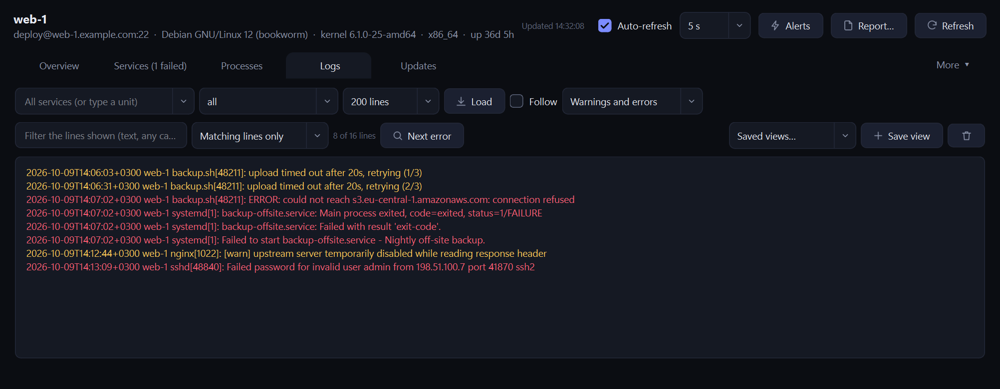</a><br><b>Logs</b>: errors and warnings highlighted, filters, next error</td>
<td><a href="docs/screens/dashboard-security.png">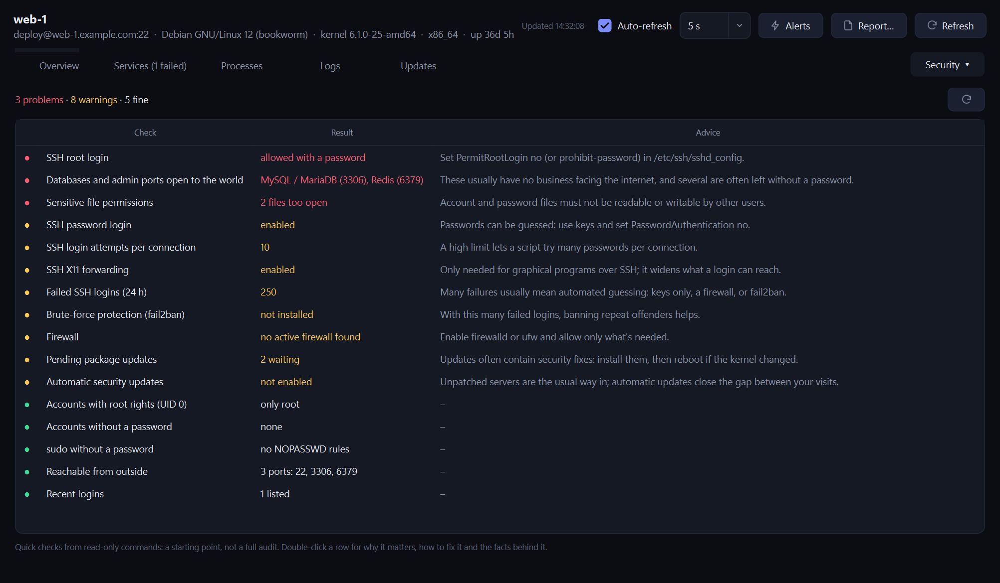</a><br><b>Security checks</b>: problems first, with advice and details</td>
</tr>
<tr>
<td><a href="docs/screens/dashboard-updates.png">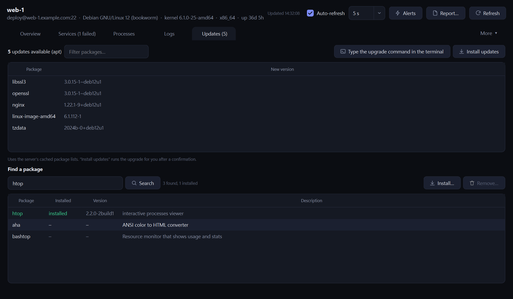</a><br><b>Updates and packages</b>: pending updates, find / install / remove</td>
<td><a href="docs/screens/dashboard-firewall.png">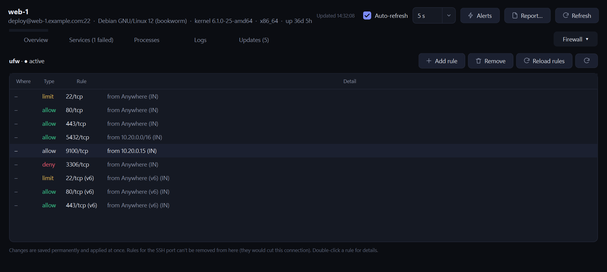</a><br><b>Firewall</b>: ufw, firewalld, iptables, nftables</td>
</tr>
<tr>
<td><a href="docs/screens/editor.png">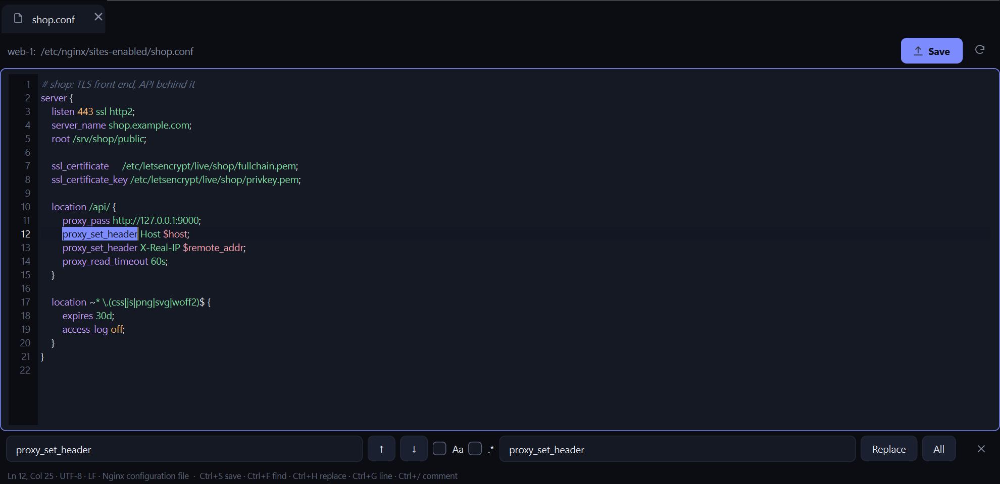</a><br><b>Built-in editor</b>: highlighting, find / replace, save to the server (sudo when needed)</td>
<td><a href="docs/screens/editor-markdown.png">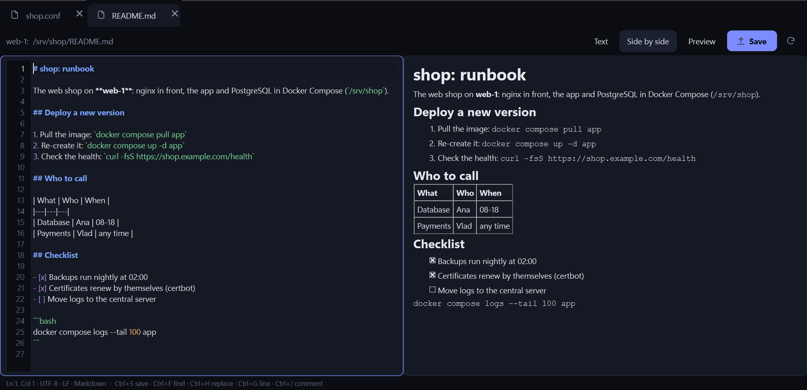</a><br><b>Markdown</b>: text, side by side, or the formatted page</td>
</tr>
<tr>
<td><a href="docs/screens/dash-docker.svg">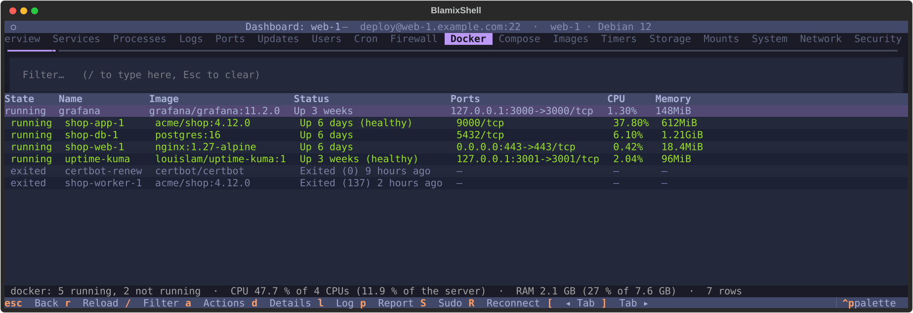</a><br><b>Terminal dashboard</b> (<code>blamixshell dash</code>): the same tabs over SSH on a headless box</td>
<td><a href="docs/screens/dash-compose.svg">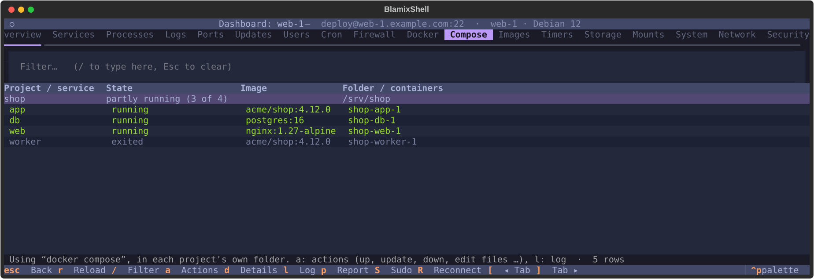</a><br><b>Compose in the terminal</b>: up, update, down, edit the files, logs</td>
</tr>
</table>

<details><summary>Terminal UI</summary>


</details>

Screenshots use demo data; `python docs/make_screenshots.py` makes them again.

## Install / run

### Windows
- **Installer (MSI):** download `BlamixShell-x.y.z-x64.msi` from Releases. The installer asks whether to install **for all users** (Program Files, needs admin) or **just for you** (no admin). It adds a Start-menu shortcut and an optional desktop shortcut, uninstalls from *Apps & features*, and upgrades in place. An installed copy keeps its data in `%APPDATA%\BlamixShell`.
  - Silent install for IT rollouts: `msiexec /i BlamixShell-x.y.z-x64.msi /qn ALLUSERS=1` (all users) or `/qn ALLUSERS=2 MSIINSTALLPERUSER=1` (current user).
- **Portable:** `BlamixShell-windows-x64.zip`, or build it yourself with **`build.bat`**, which produces `dist\BlamixShell\`. Keeps its data in a `data` folder next to the exe.
- **Build the MSI yourself:** run `build.bat`, then **`build_msi.bat`** (needs the .NET 8 SDK; it installs WiX v5 automatically).
- **From source:** install Python 3.10+, then double-click **`run.bat`**.
- The builds aren't code-signed yet, so Windows SmartScreen may show *"Windows protected your PC"*: click **More info → Run anyway**.

### macOS
- **From source:** run `./run.sh` (needs `python3`; `brew install python` if missing).
- **App bundle:** run `./build_macos.sh`, which produces `dist/BlamixShell.app` and a zip. The app is unsigned, so open it the first time with right-click → **Open**.
- **Keys:** shortcuts use **⌘**: ⌘P palette, ⌘D / ⌘E split, ⌘C / ⌘V copy/paste, ⌘F find, ⌘K clear. Ctrl is left alone for the shell.

### Ubuntu desktop (and other Linux desktops)
- **Packages:** `sudo apt install python3-venv libxcb-cursor0 libegl1`
- **From source:** run `./run.sh`
- **Portable app:** run `./build_linux.sh`, which produces `dist/BlamixShell/BlamixShell`. Then run `dist/BlamixShell/install-desktop-entry.sh` to add it to the app menu.

### Headless Linux / servers: CLI + TUI
No Qt needed; only `paramiko`, `cryptography` and `textual` are required.

```bash
./install_cli.sh          # installs `blamixshell` into ~/.local/bin (uses pipx if present)
blamixshell                 # opens the TUI
```
Or download a ready one-file binary from the release page (`blamixshell-linux-x86_64`, `blamixshell-linux-aarch64`, or `blamixshell-linux-musl-x86_64` for Alpine; they run on old systems such as CentOS 7) and keep it current with `blamixshell update --install`. Or build a portable folder with no Python needed on the target: `./build_cli.sh`, which produces `dist/blamixshell-cli/blamixshell`. `ONEFILE=1 ./build_cli.sh` makes one single executable instead (`dist/blamixshell-<os>-<arch>`).

**Server dashboard in the terminal** (the same tabs as the desktop dashboard, built from the same readers; works over SSH on a headless box):

```bash
blamixshell dash web-1                 # full screen; in the TUI, select a server and press i
blamixshell show web-1 services        # one tab as a table (a unique start of the name is enough: serv, proc, fire …)
blamixshell show web-1 processes --sort cpu --desc -f nginx
blamixshell show web-1 storage --json  # JSON for scripts
blamixshell show web-1 services --check && echo healthy   # exit code 1 when a row is marked bad (failed service, disk ≥ 90 %, …)
blamixshell show web-1 firewall --sudo # firewall, docker and security need root: ask for the sudo password
blamixshell report web-1 -o web-1.md   # Markdown report: overview, failed services, updates, ports, accounts, cron, firewall
blamixshell report web-1 --json        # the same as JSON, with a short summary (failed services, updates, fullest disk …)
```

Tabs: overview, services, processes, logs, ports, updates, users, cron, firewall, docker, compose, images (with volumes and networks), timers, storage, mounts, system, network, security. In `dash`: click a column header (or press `1`–`7`) to sort, `/` to filter, `[` and `]` for the next tab, `a` or Enter for the actions of the selected row (start/stop/restart a service, end a process, start/stop/remove a container, enable/disable a timer; each one asks first), `l` for its log (containers, services, compose projects and services); on Docker rows `a` also has details (why a container stopped, OOM, health, secrets hidden), processes, disk use, events and clean-up, and on Compose rows up / update / down and editing the compose files (checked by compose before saving), `d` (or Enter on a row without actions) for the details of a finding or row, `S` to give the sudo password, `p` to save a report, `r` to reload, `R` to reconnect after a dropped connection (it also reconnects by itself, and waits for a server you rebooted).

### Prebuilt downloads
Pushing a tag like `v1.0.0` makes GitHub Actions (`.github/workflows/release.yml`) build Windows, macOS (Apple Silicon + Intel) and Linux packages plus the Linux CLI, then attach them to a GitHub Release.

**Making a release (maintainers):** run `./release.sh v1.2.3` (Git Bash on Windows). It syncs with GitHub, runs the tests if they're installed, shows the release notes and asks before publishing. Then it commits the regenerated `CHANGELOG.md`, tags that commit, and pushes `main` and the tag together. CI never commits to `main`. Use `./release.sh --dry-run v1.2.3` to preview. Release notes and the changelog come from commit messages: commits starting with "Fix" are listed under Fixes, "Add"/"New"/"Support" under New, everything else under Improvements.

## Features

### Connecting and terminals
- **Server manager:** nested groups (`Prod/EU`), tags, colors and favorites. Drag and drop, search, or filter with `tag:prod`. A green dot marks servers with a live session. **Connect to all** opens every server in a group, tiled.
- **Real terminal:** xterm.js with 256 colors and truecolor. vim, htop, tmux and mc work. Clickable links, find in scrollback, and color themes; the whole interface has themes too (Midnight, Graphite, Nord, Solarized Dark, Light, High contrast), with font and size choices that preview live.
- **Tabs and splits:** split right or down without limit, with the same server or another one (the arrow next to the split buttons, or right-click a server → Connect in split). **Rotate** turns a side-by-side split into a stacked one and back. Each pane shows its connection state and an uptime clock. **Focus mode** (`Ctrl+Shift+H`) hides everything but the tabs and the terminal.
- **Broadcast:** send your typing, or a snippet, to every pane in a tab.
- **Auth options:** password (or ask each time), private key (a file or a pasted key, with passphrase), or SSH agent (Pageant, Windows OpenSSH, `ssh-agent`).
- **2FA / verification codes:** servers that ask for a code (Google Authenticator, Duo, PAM OTP) or any other keyboard-interactive prompt get a sign-in dialog. A saved password is filled in automatically, so you only type the code. Works for jump hosts too.
- **Jump hosts / bastions:** any saved server can be a jump host, including chains.
- **Tunnels (port forwarding):** per-server local (`-L`), remote (`-R`) and SOCKS (`-D`) tunnels that start with the connection. The pane header shows how many are up and how many connections are open; click it to copy a tunnel's address. If a server is open in several panes, its tunnels run once.
- **Agent forwarding (`ssh -A`):** per server (Advanced tab), off by default. Only turn it on for servers you trust. `ForwardAgent yes` is picked up when importing `~/.ssh/config`.
- **Host key verification:** you confirm the fingerprint on first connect. If a key changes, the connection is refused unless you explicitly replace the key (MITM protection).
- **Session restore:** your tabs and splits come back when you restart. The active tab connects right away; the others connect when you open them. Only the layout is saved (server ids), never passwords.
- **Open from the command line:** `blamixshell gui --connect web-1` (or `user@host:port`, `--key`, `--jump`; also `BlamixShell.exe --connect …`). An open BlamixShell takes the request instead of starting a second window; a new address opens the New server form filled in.
- **AWS Systems Manager (SSM):** reach EC2 instances without an open SSH port or a bastion, through your AWS CLI v2 profiles and the Session Manager plugin.
  - **SSH over SSM:** a normal SSH connection carried by Session Manager. Files, tunnels and the dashboard work as on any server.
  - **EC2 Instance Connect (optional):** each connection pushes a one-time key (valid 60 s). No keys or passwords live on the instance.
  - **SSM shell:** Session Manager's own shell, for instances without SSH (and Windows instances, which get PowerShell).
  - **AWS SSO:** when the SSO session has expired, BlamixShell offers to sign in (`aws sso login`) and reconnects. Panes of the same profile share one sign-in.
  - **Import from AWS:** pick a profile and region to list the instances Session Manager can reach, then add them as a group (`AWS/<profile>/<region>`). Importing again updates existing entries.
- **Imports and snippets:** PuTTY sessions (Windows) and `~/.ssh/config` (with `ProxyJump` and forwards); saved commands one click away.

### Files and the built-in editor
- **Files panel (SFTP):** drag and drop to upload. Download, rename, delete (recursive), create folders.
- **Built-in editor** (double-click a file; the same editor as BlamixFiles): a window with a tab per file, syntax highlighting for 500+ languages (nginx, Apache, systemd and `.env` recognised), line numbers, find / replace (regex), go to line, toggle comment, auto-indent.
  - **Ctrl+S** saves to the server. It first checks that nobody changed the file meanwhile (and shows the differences if they did), then writes a copy and renames it over the original. The encoding, line endings and permissions stay as they were.
  - Files only root may read or change open and save **with sudo** after asking; the file keeps its owner and mode.
  - **Markdown files** (`README.md`, runbooks, changelogs) have three views in the editor's toolbar: **Text**, **Side by side** (the formatted page follows as you type and scroll) and **Preview** (headings, tables, checklists, code, links). The last choice is kept for the next Markdown file.
  - Large files open read-only, binary ones not at all. Right-click → *Open in another app* opens a file in your own editor instead, uploading every save.

### Server dashboard (agentless)
Open it from the gauge button on a terminal, the toolbar, `Ctrl+Shift+I`, or right-click a server → Dashboard. It uses the connection you already have and standard commands, so nothing is installed on the server. Everything that changes the server asks first and shows the exact command; root is used only when needed (directly as root, passwordless sudo, or a sudo password you type for that dashboard only, never saved). If the connection drops, or after a reboot you started, it reconnects by itself.

- **Overview:** OS, kernel, uptime, live CPU / memory / load / swap with a short history, disk bars, failed services.
- **Services:** systemd (any version, including CentOS 7), SysV init scripts, OpenRC and supervisord. Filter, failed only, start / stop / restart / enable / disable, status, logs, the unit file, and a form for a new systemd service.
- **Processes:** filter, sort by CPU or memory, end or force-kill.
- **Logs:** the journal by service and priority (or `/var/log/messages` / `syslog` without journald), follow mode, errors in red and warnings in amber, "errors only" or "warnings and errors" for any log, a few lines around each match (like `grep -C`), *Next error*, and saved views.
- **Updates:** pending packages for apt, dnf, yum, zypper, pacman and apk. The upgrade command can be typed into your terminal for you to review, or (opt-in in Settings) installed from the dashboard. *Find a package* searches the server's package lists; install or remove one after a confirmation that lists what else a removal takes with it. Packages the system or your SSH access need are never removed from here.
- **Users:** add, delete, lock / unlock, groups, SSH keys (`authorized_keys`); who is logged in.
- **Cron and timers:** jobs in plain words, added or edited from a simple form (no cron syntax needed), run now, backups of the crontab; systemd timers with enable / disable / run now and the same form.
- **Firewall:** firewalld, ufw, iptables and nftables. Open or close a port, allow a service, save / reload, start the firewall (allowing SSH first). Rules that keep your SSH connection open can't be removed from here.
- **Security:** quick read-only checks: SSH settings, root and password-less accounts, sudo rules, failed logins and where they come from, ports open to the world (databases, admin ports), file permissions, fail2ban, automatic updates, pending security updates. Double-click a finding for why it matters and how to fix it.
- **System:** time zone (a searchable list of the zones the server knows, with each one's offset), clock drift against your computer and NTP, reboot or shut down now or later, "reboot required", add or remove a swap file.
- **Storage and mounts:** filesystems with inode use, the biggest folders under any path; `/etc/fstab` against what is mounted, mount / unmount, check the fstab.
- **Ports and network:** listening ports with their processes; interfaces, addresses, routes, DNS, and name lookup / ping / TCP checks run from the server.
- **Report:** one button collects a Markdown report (overview, failed services, updates, ports, accounts, cron, firewall) for a ticket or a handover.

### Docker, Podman and Compose
In the dashboard's Docker tab (and the terminal dashboard), with the totals of the running containers: CPU (100 % is one full CPU) and RAM, in proportion to the server.
- **Containers:** state, image, ports, CPU and memory. Start, stop, restart, remove; **Logs** (also on double-click); **Details** explains why a container stopped (exit code in plain words, out of memory, restarts, health checks, limits, ports, networks, mounts; environment values that look like secrets are hidden); **Processes** inside it; **Shell** types `docker exec -it …` into your terminal. Right-click a row for the same actions.
- **Compose projects:** found from their containers (`docker compose`, `docker-compose`, `podman compose`, `podman-compose`). Up, stop, restart, update (pull and re-create what changed), down, logs, status, check config, and per service logs / restart / re-create. **Edit the compose files**: a new version is saved only after Compose accepts it (with the project's other files and its `.env`), the previous one is kept as `<file>.bak-<time>`, then applied if you want.
- **Images, volumes and networks:** which containers use each image, its layers, pull again, remove (not while in use); volume and network details and removal (never the engine's own networks).
- **Engine:** disk use, events of the last hour (containers that died or were killed for memory, restarts, pulls), engine info, and **Clean up** for stopped containers, unused images, volumes, networks and the build cache, each one confirmed.

### Monitoring and records
- **Health strip:** CPU, memory, root disk and load of the active terminal's server in the status bar (amber / red when high). Click it for the dashboard. Optional warnings (Settings) when a server crosses disk or memory 90 %, swap 60 % or load 1.5 per CPU.
- **Alerts history:** when a server crossed those limits or a service failed, and for how long, with the worst value. Right-click the health strip, *Alerts* in the dashboard, or the command palette. Kept on this computer for 30 days.
- **Command log:** who ran what, where and when: one line per command as shown on screen (history recall and tab completion included), plus the dashboard's actions and `blamixshell exec`. A file a day in `logs/commands`, tab-separated. For every server (Settings → Logging) or only some (the server's Advanced tab). Password prompts and full-screen programs are skipped.
- **Session recordings:** the **●** button on a terminal records what it shows to `logs/sessions/<server>/<date-time>.log`, as clean text or raw, optionally time-stamped. Servers can record every session automatically; old recordings can be deleted after N days.

### Vault, backups and sign-in
- **Encrypted vault:** one AES-256-GCM file; the key comes from your master password via scrypt. The same file works on every OS and in every front-end.
- **Unlock with Windows** (optional): the master password kept encrypted by Windows for your account (DPAPI), so BlamixShell opens without asking on this PC. Turn it on in the unlock window or Settings → Vault. Details under [Where data lives](#where-data-lives).
- **Backups and sync:** one encrypted backup a day (the last 20 kept), plus Back up now, Export, Import (adds servers, never overwrites) and Restore, in Settings → Vault & backups. To use the same servers on several computers, put the vault in a synced folder (OneDrive, Dropbox, Syncthing); edits from both sides are merged.
- **Colors for production:** give a server or a whole group a color. Its tab, pane header and terminal background get tinted, so production looks different at a glance.

## CLI

```text
blamixshell                          TUI (or the desktop app via `blamixshell gui`)
blamixshell gui --connect <name|user@host:port> [--key FILE] [--jump SERVER]
                                   open a server in the desktop app (in the window that is already
                                   open, if any); a saved server is reused, a new address opens the
                                   New server form filled in. Never a password on the command line.
                                   Also: BlamixShell.exe --connect web-1
blamixshell ls [query]               list servers  (e.g. `blamixshell ls tag:prod`)
blamixshell connect <name|user@host:port> [-A] [--record] [-L ..] [-R ..] [-D ..]
                                   interactive shell; the server's saved tunnels start too
blamixshell status <name> [-s]         CPU, memory, disks, failed services (-s: list services);
                                   exits with 1 when services have failed (handy for scripts)
blamixshell tunnel <name> [-L 5432:localhost:5432] [-D 1080] [--only]
                                   run tunnels without a shell until Ctrl+C
blamixshell exec <query> [-A] -- <cmd>  run on many servers in parallel (-A: forward your agent)
      e.g.  blamixshell exec group:Prod/EU -- 'df -h / | tail -1'
            blamixshell exec tag:web --accept-new -y -- sudo systemctl reload nginx
blamixshell add [--name --host --user --auth --key --group --tags --jump]
                 [--ssm ssh|shell --aws-profile P --aws-region R --eic]   (host = instance id)
blamixshell aws login [--profile P]   AWS SSO sign-in (aws sso login)
blamixshell aws instances [--profile P] [--region R] [--online] [--json]
                                   EC2 instances reachable through Session Manager
blamixshell aws import [--profile P] [--region R] [--group G] [--user U] [--shell] [--no-eic]
blamixshell rm <name>
blamixshell import ssh-config|putty
blamixshell passwd                   change the master password
blamixshell where                    show where data is stored
blamixshell report <name> [-o FILE] [--json]
                                   Markdown report, or JSON for scripts
```

TUI keys: `/` search · `⏎` connect · `a` add · `e` edit · `d` delete · `f` favorite · `x` run a command on the selected group · `q` quit. When you connect, the TUI steps aside and gives you the real shell; exit the shell to come back.

## Desktop keyboard shortcuts

| Windows / Linux | macOS | Action |
|---|---|---|
| Ctrl+Shift+P / T | ⌘P / ⌘T | Command palette and quick connect |
| Ctrl+Shift+D / E | ⌘D / ⌘E | Split right / down (same server; the arrow on the button picks another) |
| Ctrl+Shift+O | ⌘O | Rotate split: side by side ↔ stacked |
| Ctrl+Shift+W | ⌘W | Close pane |
| Ctrl+Shift+C / V | ⌘C / ⌘V | Copy / paste |
| Ctrl+Shift+F | ⌘F | Find in terminal |
| Ctrl+Shift+S | ⌘S | Files (SFTP) panel |
| Ctrl+Shift+I | ⌘I | Server dashboard |
| Ctrl+Shift+B | ⌘B | Broadcast |
| Ctrl+Shift+R | ⌘R | Reconnect |
| Ctrl+Shift+1…9 | ⌘1…9 | Switch tab |
| Ctrl + = / − / 0 | ⌘ = / − / 0 | Font size |

## Updates

BlamixShell checks GitHub Releases for a newer version at most once a day (a single anonymous request to `api.github.com`; nothing about you or your servers is sent). You can switch this off, or run **Check now**, in **Settings → Updates**. From the CLI, run `blamixshell update`; with the one-file binary, `blamixshell update --install` downloads the matching file from the release, checks its SHA-256 and replaces the running program (`-y` skips the question).

**Offline computers:** copy the new `BlamixShell-x.y.z-x64.msi` (or the portable zip) over, then **Help → Install update from file…**. It shows the file's SHA-256 so you can compare it with the release page (paste it to have it checked).

When an update is found, an **Update x.y.z** button appears in the status bar. It opens the release notes with these options:
- **MSI install:** *Install & restart* downloads the new MSI, checks its SHA-256, and upgrades in place.
- **Portable Windows folder:** *Install & restart* downloads the new zip, swaps the program files after BlamixShell closes (your `data` folder is never touched), and restarts.
- **macOS / Linux / pip / source:** *Release page* opens the download page (or use `pipx upgrade blamixshell` / `git pull`).

## Offline and managed installs

BlamixShell has no account, no telemetry and no license server. The only thing it ever contacts on its own is the update check (one request to `api.github.com`, at most daily), which an administrator can turn off for everyone:

```text
msiexec /i BlamixShell-x.y.z-x64.msi /qn ALLUSERS=1 UPDATECHECK=0       all users, update check off
msiexec /i BlamixShell-x.y.z-x64.msi /qn ALLUSERS=2 MSIINSTALLPERUSER=1 UPDATECHECK=0   just for the user
```

`UPDATECHECK=0` locks the setting off (Settings shows "managed by your administrator"; `UPDATECHECK=1` forces it on). The choice is kept by later upgrades. Other ways to set the same policy:
- **Group Policy / registry:** `UpdateCheck` = `0` under `HKLM\SOFTWARE\Policies\BlamixShell` (or `HKLM\SOFTWARE\BlamixShell`).
- **Portable copy, macOS, Linux:** a `policy.ini` next to the app (`BlamixShell.exe` / `run.py`), or `/etc/blamixshell/policy.ini`, or `/Library/Application Support/BlamixShell/policy.ini`:
  ```ini
  [policy]
  update_check = false
  ```
- **Environment:** `BLAMIXSHELL_UPDATE_CHECK=0`.

Updates on offline machines: **Help → Install update from file…** (see *Updates*). The AWS features only talk to AWS through your AWS CLI when you use them.

## Where data lives

**Portable by default:** data goes in a `data/` folder next to the executable (next to `BlamixShell.app` on macOS, or next to `run.py` when running from source). It holds:
- `vault.sdv`: encrypted servers, passwords, keys and snippets. **Back it up.** If you forget the master password, the data can't be recovered.
- `known_hosts`: trusted host keys (OpenSSH format).
- `settings.json`: UI preferences only. No secrets.
- `logs/`: the command log and session recordings, when you turn them on (the folder can be changed in Settings → Logging).
- `unlock-windows.json` (Windows, only if you turn it on): the master password encrypted by Windows for your account (DPAPI), so BlamixShell and the CLI open without asking on this PC. Turn it on with "Remember on this Windows account" in the unlock window or in Settings → Vault; it can't be decrypted on another PC or by another Windows user, but anything running as you on this PC could, so leave it off on shared PCs. After **Lock vault** it still asks (one click: *Unlock with Windows*). A changed master password is updated; a stale copy is dropped and you're asked once.

If that folder isn't writable, or the app is installed (in `/Applications`, via pip/pipx, or under Program Files), BlamixShell uses the per-user folder instead: `%APPDATA%\BlamixShell`, `~/Library/Application Support/BlamixShell`, or `~/.config/blamixshell`. Run `blamixshell where` to see which one is in use. To share one vault between machines, copy `data/`. You can also set `BLAMIXSHELL_HOME` to point anywhere.

**Coming from ShellDeck (1.1 and older)?** On first start BlamixShell copies your vault, settings and known hosts from the old folder (`%APPDATA%\ShellDeck`, `~/Library/Application Support/ShellDeck` or `~/.config/shelldeck`). The old folder is left in place as a backup; delete it once you're happy. For a portable ShellDeck folder, copy its `data` folder next to `BlamixShell.exe`. The Windows installer upgrades a ShellDeck install in place (it moves to `Program Files\BlamixShell`).

## Notes
- PuTTY `.ppk` keys: in PuTTYgen, open the key and choose **Conversions → Export OpenSSH key**, then use the exported file.
- Tests: `pip install pytest pexpect textual`, then `pytest tests`. 2FA and tunnel tests use a small in-process SSH server (`tests/sshserver.py`), so they need no setup. To include the live tests against a real OpenSSH server, set `BLAMIXSHELL_TEST_SSH=host:port:user:password` and, for a keyboard-interactive-only server, `BLAMIXSHELL_TEST_SSH_KBD=host:port:user:password`.
- Roadmap: see [ROADMAP.md](ROADMAP.md).

## Project layout

```
blamixshell/
  main.py          desktop entry: unlock/create vault
  app.py           main window, palette, tree actions, imports
  server_tree.py   sidebar tree + custom row painting
  session_tab.py   tab with nested split panes, broadcast routing
  terminal.py      xterm.js <-> Python bridge (QWebChannel), pane UI
  ssh_session.py   Qt wrapper: shell I/O thread → signals
  ssh_core.py      Qt-free SSH core: auth incl. 2FA prompts, host keys, jump hosts, SSH over SSM (shared by all front-ends)
  aws.py           Qt-free AWS support (through the AWS CLI): SSM proxy, SSO, Instance Connect, instance listing
  aws_ui.py        AWS sign-in and import dialogs
  pty_process.py   local programs in a terminal (ConPTY / pty), used for SSM shells
  tunnels.py       Qt-free port forwarding: local, remote, SOCKS4/5
  dashboard.py     Qt-free server dashboard: collectors, parsers, sudo-aware actions
  collect.py       the dashboard's tabs as tables + their actions (terminal dashboard, `show`, report)
  system.py, firewall.py, security.py, docker.py, compose.py, packages.py, cron.py, timers.py,
  storage.py, sshkeys.py, units.py, loglines.py
                   Qt-free readers and command builders behind the dashboard tabs
  dashboard_ui.py  dashboard window
  alerts.py        alerts history (alerts_ui.py: its window)
  sftp_panel.py    SFTP browser, transfers, edit-in-place
  editor.py        built-in editor (from BlamixFiles); remote_file.py: SFTP / sudo read and save
  cli.py           command line + interactive raw-tty shell + parallel exec
  tui.py           Textual full-screen UI; tui_dash.py: the terminal dashboard
  handoff.py       `gui --connect`: hand a server to the window that is already open
  oskey.py         unlock with the Windows account (DPAPI)
  report.py        Markdown / JSON server report
  vault.py         AES-256-GCM + scrypt encrypted store
  models.py        Server / Tunnel / Snippet / Store
  links.py         project, docs and donation links
  dialogs.py       unlock, server editor, settings, snippets, palette
  theme.py         colors, stylesheet, SVG icons, Windows title bar
  platform_ui.py   per-OS fonts, scaling and shortcut labels
  assets/          xterm.js 6 (MIT), terminal.html, icons
```

## How this was built

> 🤖 **DevOps-designed, AI-written.** I'm a DevOps engineer, not a software developer. The code in
> this repository was written by AI (Claude). My part is the product: what to build and why, based on
> day-to-day infrastructure work; the requirements, workflows and UI; testing every build on real
> machines, reporting what breaks, and deciding what ships. Every release passes the automated tests
> and CI builds described above before it's published.

Security reviews are very welcome. The parts that matter most are the vault encryption
(`blamixshell/vault.py`) and host-key checking (`blamixshell/ssh_core.py`). Please report security
issues privately through GitHub's **Report a vulnerability** (Security tab) rather than a public issue.

## Made by


BlamixShell is built and maintained by [Blamixology](https://blamixology.ro/en): custom software, automation and AI solutions.

## Support

BlamixShell is free and open source, with no paid tier and no locked features. If it saves you time,
you can [☕ buy me a coffee on Ko-fi](https://ko-fi.com/blamixology) or
[sponsor on GitHub](https://github.com/sponsors/blamixology). The app never asks: the link is only in
**Help → Buy me a coffee** and the About dialog.

## License

MIT. See [LICENSE](LICENSE) and [THIRD_PARTY_NOTICES.md](THIRD_PARTY_NOTICES.md).
